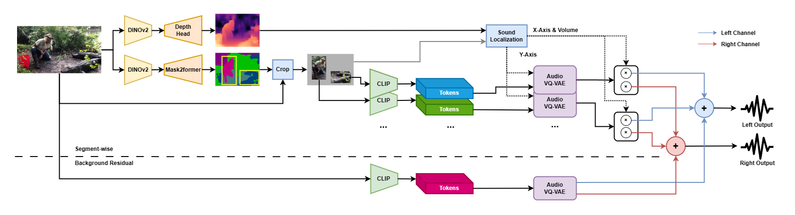
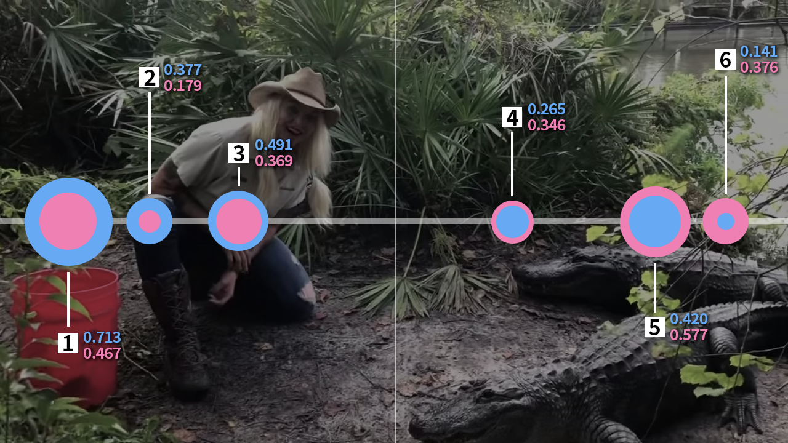

** This is a still ongoing project.

# IM4WAV

*IM4WAV Architecture Diagram*

## Abstract

*Sound Localization*

This project introduces a novel redesign to an image-to-audio model designed to enhance a current multi-modal technique improving experiences in computer vision by converting images into stereo audio. Current research in this field predominantly focuses on text and image interpretations, but significantly lacks in auditory dimensions. Our model addresses this gap by enabling the translation of visual content into immersive and engaging sound experiences. Our proposed model, inspired by the "I Hear Your True Colors: Image Guided Audio Generation" paper from Roy Sheffer and Yossi Adi, extends the IM2WAV by incorporating stereo audio to simulate a more realistic and immersive auditory environment. Our model redesigns the processing of images to identify objects, analyze their positions and depths with DINOv2 to do sound localization, encode the segmented image into latent space with pre-trained CLIP models, generate a corresponding audio file with VQ-VAE, and then apply the sound localization to the outputs. For instance, it can differentiate and spatially represent sounds from varying sources within an image, like conversations from a crowd on one side and car noises on the other, in a stereo format. For the audio generation part, we built upon the basis of IM2WAV's VQ-VAE structure. Eventually, we successfully outperformed IM2WAV for the stereo audio generation performance by testing left and right channels separately. This is a model for stereo audio generation while only requiring one single image, making it probably the easiest and the most interesting model to use for image-to-audio generation.
